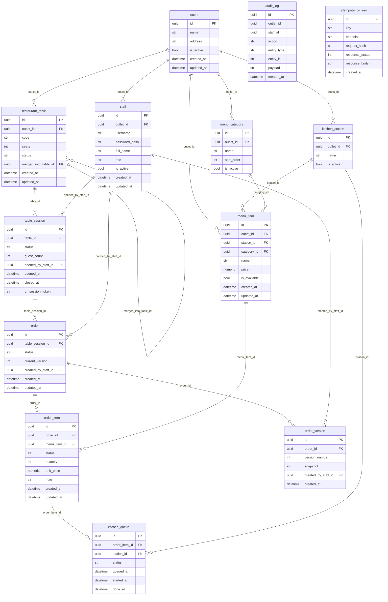

# ERD — POS System (Release 1)

> File sinh tự động bởi `scripts/generate_erd.py` từ `app/db/models.py`. Không sửa tay — sửa model rồi chạy lại script.

```mermaid
erDiagram
    "outlet" ||--o{ "restaurant_table" : "outlet_id"
    "restaurant_table" ||--o{ "restaurant_table" : "merged_into_table_id"
    "restaurant_table" ||--o{ "table_session" : "table_id"
    "staff" ||--o{ "table_session" : "opened_by_staff_id"
    "outlet" ||--o{ "kitchen_station" : "outlet_id"
    "outlet" ||--o{ "menu_category" : "outlet_id"
    "outlet" ||--o{ "menu_item" : "outlet_id"
    "kitchen_station" ||--o{ "menu_item" : "station_id"
    "menu_category" ||--o{ "menu_item" : "category_id"
    "table_session" ||--o{ "order" : "table_session_id"
    "staff" ||--o{ "order" : "created_by_staff_id"
    "order" ||--o{ "order_item" : "order_id"
    "menu_item" ||--o{ "order_item" : "menu_item_id"
    "order" ||--o{ "order_version" : "order_id"
    "staff" ||--o{ "order_version" : "created_by_staff_id"
    "order_item" ||--o{ "kitchen_queue" : "order_item_id"
    "kitchen_station" ||--o{ "kitchen_queue" : "station_id"
    "outlet" ||--o{ "staff" : "outlet_id"
    "outlet" {
        uuid id PK
        str name
        str address
        bool is_active
        datetime created_at
        datetime updated_at
    }
    "restaurant_table" {
        uuid id PK
        uuid outlet_id FK
        str code
        int seats
        str status
        uuid merged_into_table_id FK
        datetime created_at
        datetime updated_at
    }
    "table_session" {
        uuid id PK
        uuid table_id FK
        str status
        int guest_count
        uuid opened_by_staff_id FK
        datetime opened_at
        datetime closed_at
        str qr_session_token
    }
    "kitchen_station" {
        uuid id PK
        uuid outlet_id FK
        str name
        bool is_active
    }
    "menu_category" {
        uuid id PK
        uuid outlet_id FK
        str name
        int sort_order
        bool is_active
    }
    "menu_item" {
        uuid id PK
        uuid outlet_id FK
        uuid station_id FK
        uuid category_id FK
        str name
        numeric price
        bool is_available
        datetime created_at
        datetime updated_at
    }
    "order" {
        uuid id PK
        uuid table_session_id FK
        str status
        int current_version
        uuid created_by_staff_id FK
        datetime created_at
        datetime updated_at
    }
    "order_item" {
        uuid id PK
        uuid order_id FK
        uuid menu_item_id FK
        str status
        int quantity
        numeric unit_price
        str note
        datetime created_at
        datetime updated_at
    }
    "order_version" {
        uuid id PK
        uuid order_id FK
        int version_number
        str snapshot
        uuid created_by_staff_id FK
        datetime created_at
    }
    "kitchen_queue" {
        uuid id PK
        uuid order_item_id FK
        uuid station_id FK
        str status
        datetime queued_at
        datetime started_at
        datetime done_at
    }
    "staff" {
        uuid id PK
        uuid outlet_id FK
        str username
        str password_hash
        str full_name
        str role
        bool is_active
        datetime created_at
        datetime updated_at
    }
    "audit_log" {
        uuid id PK
        uuid outlet_id
        uuid staff_id
        str action
        str entity_type
        str entity_id
        str payload
        datetime created_at
    }
    "idempotency_key" {
        uuid id PK
        str key
        str endpoint
        str request_hash
        int response_status
        str response_body
        datetime created_at
    }
```
